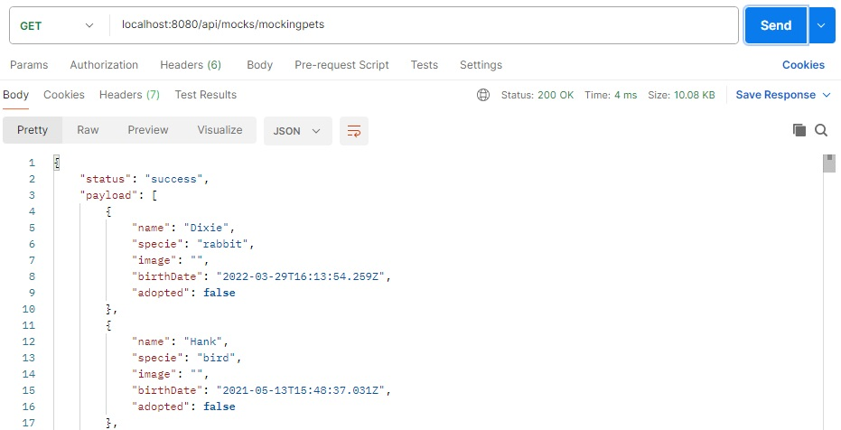
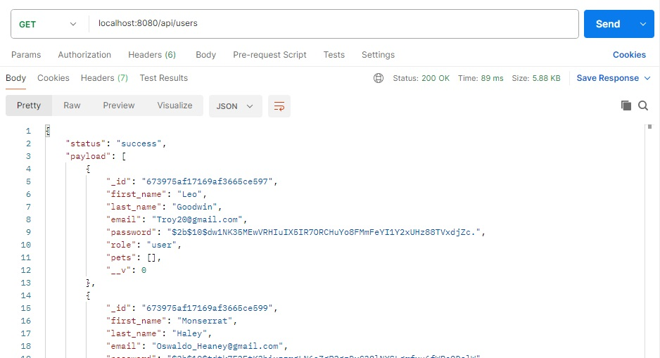
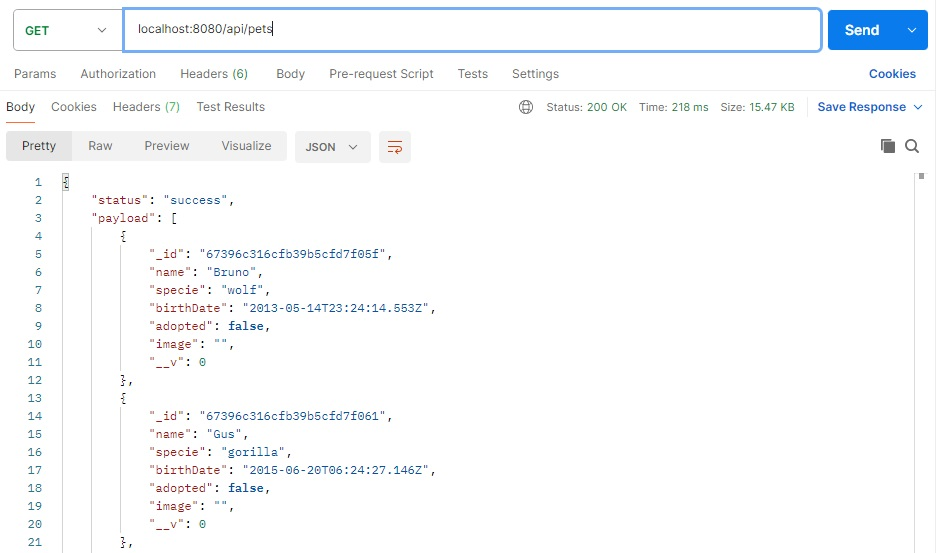
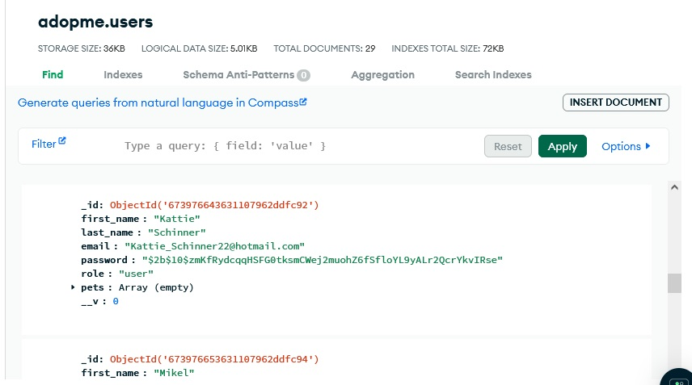
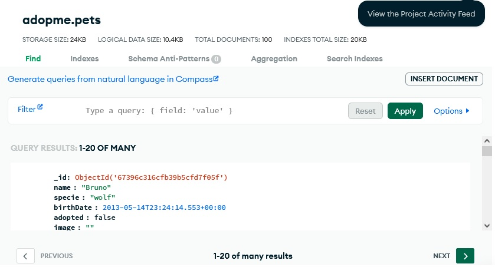

# Primera Pre entrega del Curso de PROGRAMACION BACKEND III de CODERHOUSE

### Descripción del proyecto:

Se tomó como base el proyecto de un servidor basado en Node.JS y express, con persistencia en una base de datos Mongo. Se creó un módulo de Mocking con el fin de generar mascotas y usuarios. Se incorpora Faker-js.

### Pasos para probar el proyecto:

- Desde una terminal clonar el proyecto en su máquina local

```batch
git clone https://github.com/ingridlch/Entrega1Backend3.git
```

- Situarse en el directorio del proyecto que se creó al clonar e instalarlo con:

```batch
npm install
```

- Configurar las variables de entorno en el archivo .env ubicado en la raíz del proyecto. En env.example se listan cuales se deben configurar.

### Endpoints de la API

Se incluyen capturas de pruebas realizadas en Postman que demuestran su funcionamiento y de los registros generados en Mongo.

**GET** `/api/mocks/mockingpets`: Genera 100 mascotas con el mismo formato que entregaría una petición de Mongo (sin owner y con adopted en “false”).


**GET** `/api/mocks/mockingusers`: Genera 50 usuarios con el mismo formato que entregaría una petición de Mongo. La “password” contiene la contraseña “coder123” encriptada, el valor “role” varía entre “user” y “admin”, y o “pets” se completa con un array vacío.


**POST** `/api/mocks/generateData`: Recibe los parámetros numéricos "users" y "pets" para generar e insertar en la base de datos la cantidad de registros indicados. Se comprueba dichos registros insertados con los servicios GET de users y pets (/api/users y /api/pets).






